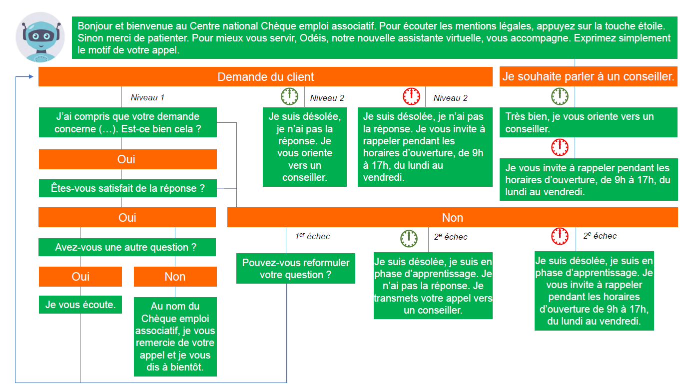

# PIAF : oui, mais pour quoi faire ?

Il y a quelques mois, nous avons lancé le projet PIAF, Pour des Intelligences Artificielles Francophones. PIAF part du constat qu’il n’existe aujourd’hui pas de jeu de données francophone pour entraîner des algorithmes d’intelligence artificielle (IA) de questions-réponses, une tâche bien particulière de traitement automatique de langage. **L’objectif de PIAF est de pallier ce manque en construisant de manière collaborative un jeu de questions-réponses en français, public et ouvert.** Ce post vous propose d’explorer l’utilité et les cas d’usages du futur jeu de données de PIAF.

## Concrètement, c’est quoi un algorithme de question réponse ?

C’est un algorithme qui permet de trouver des réponses à des questions précises portant sur un ensemble de documents. Par exemple, si vous lui donnez comme document l’article Wikipédia « Harry Potter », vous pourrez lui demander « Qui sont les amis de Harry ? », « Quand le premier livre a-t-il été publié ? », ou encore « A combien d’exemplaire a-t-il été écoulé ? ». En retour, l’algorithme vous répondra en pointant des portions du texte d’origine, comme par exemple « Ron Weasley et Hermione Granger » pour la première question.
Construire des algorithmes performants de questions-réponses (*question-answering* en anglais) compte aujourd’hui parmi les tâches les plus complexes du traitement du langage naturel, domaine de l’IA qui s’intéresse au langage.

Oui mais concrètement, à quoi ça sert un algorithme de questions-réponses ? Au quotidien, l’utilité d'une IA qui répond correctement à des questions sur le monde d’Harry Potter peut paraître limitée. Depuis que nous avons lancé le projet, nous organisons chaque semaine des moments contributifs et nous présentons le projet à différentes admnistrations. Nos interlocuteurs nous demandent systématiquement des exemples de réutilisations potentielles de PIAF. Cet article vous propose donc d’explorer trois cas d’usage concrets de PIAF dans l’administration.

## Améliorer les agents conversationnels : l’exemple du voicebot de l’ACOSS

Un chatbot, ou agent conversationnel en français, est une IA spécialisée dans l’interaction avec un utilisateur. Il prend le plus souvent la forme d’un assistant virtuel avec lequel vous pouvez discuter par messagerie instantanée, sur des sites comme [celui de la SNCF](https://www.oui.sncf/bot), afin d'apporter une assistance rapide en répondant à des questions simples. On les retrouve aussi au téléphone, sous la forme d'assistants vocaux.

Prenons l’exemple de l’ACOSS, l'Agence Centrale des Organismes de Sécurité Sociale, qui gère de nombreux dispositifs dont le chèque emploi associatif (CEA). Vous ne savez pas ce que c’est ? L’un des réflexes que vous pourriez avoir est d’appeler l’ACOSS pour poser vos questions. Dans le cadre du premier Appel à Manifestation d’Intérêt pour l’IA lancé par le Lab IA, **l’ACOSS a développé un voicebot capable de répondre à des questions simples sur le CEA au téléphone, et au besoin, de réorienter l'utilisateur vers un conseiller humain afin de répondre à des questions plus complexes.**

*L'arbre de réponses du voicebot de l'ACOSS, pour l'instant très figé*

Mais quel est l'apport de PIAF dans tout ça ? A l’heure actuelle, les agents conversationnels fonctionnent principalement par identification de mots clés. Par exemple, vous dites « Comment souscrire au CEA ? » et le voicebot de l’ACOSS reconnait « souscrire » comme mot clé et vous propose la réponse prévue par un ensemble de règles préconçues. C’est donc un système qui manque de flexibilité (et donc finalement d’ « intelligence ») puisque si cet ensemble de règles et de mots clés n’a pas anticipé votre question, le voicebot se retrouvera… sans voix. Enrichir cette approche par règles à l’aide d’un système de questions-réponses permettrait à l’IA de « poser votre question » à un ensemble documentaire (par exemple l’ensemble de la documentation disponible sur le CEA) et de vous faire remonter la meilleure réponse trouvée. Le chatbot devient donc plus flexible et capable de répondre à un ensemble bien plus vaste de questions ! 

Pour les utilisateurs, le service obtenu est de meilleure qualité pour deux raisons principales. D'une part, le temps d’attente est moins long puisque l’IA peut répondre à toutes les requêtes en même temps. D'autre, si la question posée est trop complexe pour l'agent virtuel, l'utisateur est redirigé vers un agent humain, joignable plus rapidement puisque ceux-ci ont plus de temps disponible. Côté administration, les agents chargés de répondre aux questions des utilisateurs peuvent se concentrer sur des questions plus complexes et avec une plus grande valeur ajoutée, et ne pas crouler sous les questions "basiques" du type « C’est quoi le CEA ? ». 

## Enrichir des solutions existantes : l’exemple du code du travail numérique

Le [code du travail numérique](https://code.travail.gouv.fr/) est un projet mené par le ministère du travail, dont le but est de rendre le droit du travail accessible et compréhensible à tous. **Le format retenu est un moteur de recherche, qui permet à chacun de poser des questions sur le droit du travail** et d’obtenir en réponse des extraits pertinents de textes légaux. Par exemple, si vous demandez « Quelle est la durée du préavis pour ma démission ? », l’algorithme vous indique les documents les plus susceptibles de répondre à votre question parmi un ensemble de documents constitué d'articles du code du travail, de conventions collectives et de fiches détaillées écrites par des agents du ministère du travail. Certaines réponses sont personalisables en fonction de la situation de chacun: la durée du préavis de démission va par exemple dépendre de l'ancienneté, du type de convention collective, etc.

L’approche utilisée aujourd’hui repose sur un moteur de recherche, qui sélectionne le document le plus adéquat en fonction, pour faire simple, d’une proximité linguistique par rapport à la question. **L’apport d’un système de questions-réponses entraîné grâce à PIAF serait de fournir une réponse encore plus précise à l’utilisateur.** Une fois le document le plus adéquat identifié par l’algorithme déjà en place, le système de questions-réponses permettrait d’identifier précisément dans le texte le passage qui répond à la question de l’utilisateur. Cela permet à l’utilisateur de ne pas lire un pan entier de texte de loi et d’obtenir plus rapidement l’information qu’il recherche.

## Proposer de nouvelles approches scientifiques : l’exemple de la pseudonymisation des décisions de justice

Les algorithmes de questions-réponses permettent aussi d’explorer de nouvelles pistes dans des tâches de traitement automatique du langage. Par exemple, à Etalab, nous travaillons sur la pseudonymisation des décisions de justice. Le principe de l'ouverture des décisions de justice a vocation à permettre une plus grande transparence de la justice, mais nécessite l'occultation d’informations personnelles comme des noms et des adresses, afin de respecter la vie privées des personnes mentionnées dans les décisions. A l'heure actuelle, ce travail colossal doit être réalisée à la main (humaine), ce qui empêche une publication généralisée des 3,9 millions de décisions produites chaque année. Nous travaillons donc à l'automatisation de cette tâche, en ayant recours à diverses approches de traitement automatique du langage, la plus évidente étant la reconnaissance d’entités nommées qui consiste à reconnaitre la catégorie d’éléments d’une phrase : noms de personnes, noms d'organisations ou d'entreprises, noms de lieux, quantités, dates, etc. Une fois ces éléments reconnus, il suffit de retirer les éléments relevant de catégories comme les noms et les lieux.

**L’apport d’un algorithme de questions-réponses serait de proposer une nouvelle approche, complémentaire de celle utilisée aujourd’hui, pour reconnaître les éléments à pseudonymiser.** En posant comme question « Qui ? », « Quand ? » ou encore « Où ? », un algorithme de questions-réponses est capable de faire de la reconnaissance d’entités nommées ! Entraîné sur un volume conséquent de données comme celui créé par PIAF, il offre donc des possibilités d’enrichissement de méthodes existantes de traitement du langage, complémentaires, et permettant d’améliorer leurs performances.

On l’a vu, les possibilités d'utilisations du jeu de données PIAF dans l’administration couvrent des thématiques et des tâches variées, en offrant la perspective de proposer de meilleurs services aux citoyens grâce à des agents virtuels, des moteurs de recherche ou des moteurs de pseudonymisation plus performants. De nombreux autres cas d'usages sont probablement à explorer dans le monde de l’entreprise, de l’association ou de la recherche !

N’hésitez pas à nous envoyer les vôtres à [piaf@data.gouv.fr](mailto:piaf@data.gouv.fr) !
