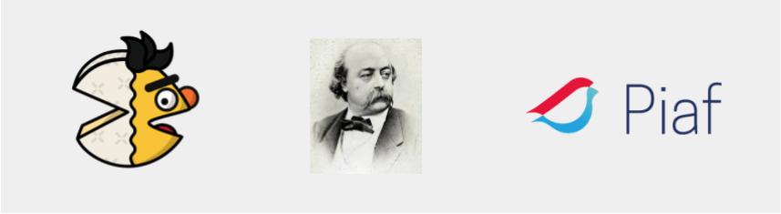
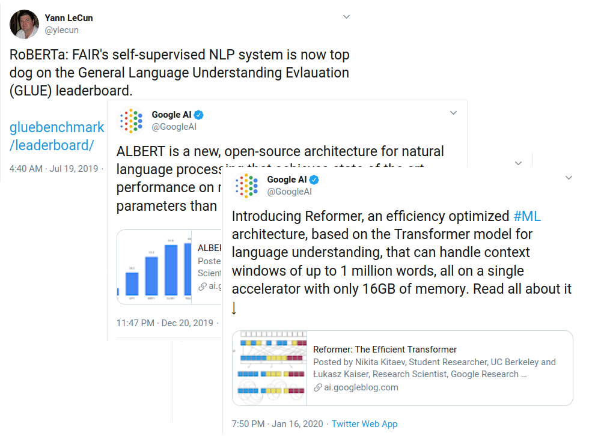
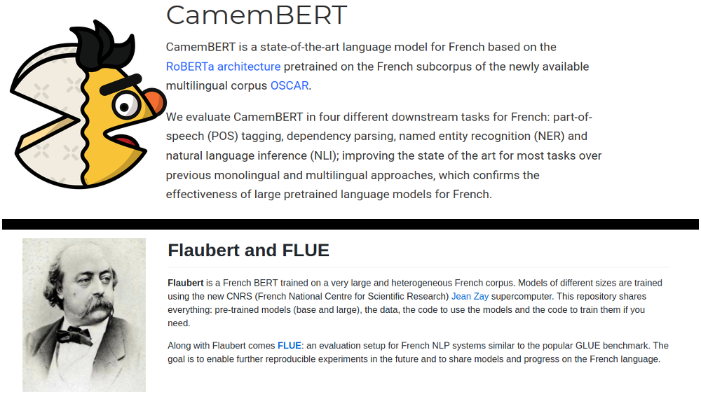
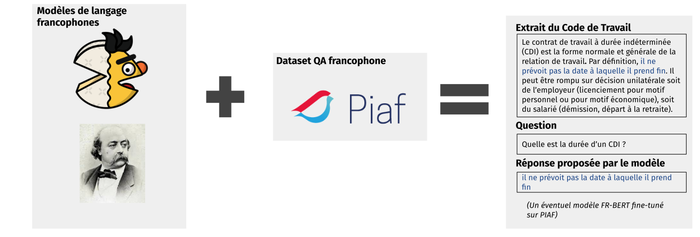

# Maître PIAF tenait en son bec un camemBERT
## Ou comment la francophonie continue à se faire de la place dans l'IA : FlauBERT, CamemBERT, PIAF

Aujourd’hui, tester différentes approches de Traitement Automatique du Langage (NLP, de Natural Language Processing en anglais) devient de plus en plus simple : il vous suffit d'installer les bibliothèques appropriées, de télécharger les modèles pertinents et d'analyser les données. Les bibliothèques telles que [scikit-learn](https://scikit-learn.org/stable/), [spaCy](https://spacy.io/), [flair](https://github.com/flairNLP/flair), [Transformers](https://huggingface.co/transformers/), pour n’en citer que quelques unes, nous permettent d'expérimenter rapidement les modèles de NLP une fois que nos données sont prêtes. Bien que cela soit généralement vrai pour l'anglais, lorsque l’on s’attèle à analyser d'autres langues, comme le français, les tâches basiques comme la segmentation des phrases ou la tokenisation, s’avèrent être beaucoup moins triviales. Cette difficulté est principalement due à l'absence de modèles français (pré)-entraînés sur des données de qualité en langue française.
Malheureusement, la construction de jeux de données en NLP est souvent une tâche longue et fastidieuse. De plus, l'obtention des données d’entraînement ne marque pas la fin du voyage, puisque l’entraînement des nouveaux algorithmes de pointe nécessite d'énormes ressources de calcul.
Pour relever ce défi, plusieurs laboratoires de recherche et entreprises francophones travaillent depuis longtemps à la démocratisation du NLP francophone et ont publié à la fois des modèles pré-entraînés et des corpus de textes français.  Ces derniers mois, des ressources très intéressantes en NLP français ont émergé. Nous faisons ici référence à [CamemBERT](https://camembert-model.fr/), [FlauBERT](https://github.com/getalp/Flaubert) et [PIAF](https://piaf.etalab.studio) (Pour une IA Francophone). Les deux premiers sont des modèles de langage pré-entraînés et le dernier est un jeu de données de Question-Réponse (QA) en français. 

Dans ce blogpost, nous nous intéressons à ces trois projets. Premièrement, nous faisons une description rapide des modèles camemBERT et FlauBERT. Nous poursuivons avec une présentation plus détaillée du projet PIAF que nous avons développé à [Etalab](https://www.etalab.gouv.fr/). Finalement, nous réfléchissons à la manière d’orchestrer ces trois ressources.

## Publication des modèles francophones

### Mais qu’est-ce que c’est et pour quoi faire?

Lorsque nous construisons un système de traitement automatique du langage, nous utilisons généralement l'apprentissage automatique (machine learning en anglais). Puisque la machine ne comprend que les nombres, nous devons donc représenter chaque mot (ou token) de notre texte par une liste de valeurs numériques. L'une des principales promesses de l'apprentissage profond est que nous n'avons pas besoin de déterminer explicitement ces listes de valeurs. Dans le domaine du NLP, cela se traduit par des représentations vectorielles « sur étagère » de qualité des mots contenus dans les textes analysés. Ces représentations sont appelées « word embeddings »: des vecteurs représentant les mots au moyen de caractéristiques apprises en regardant de grandes quantités de textes. De plus, aujourd'hui, nous pouvons aller plus loin et utiliser ces modèles pré-entraînés, capturant les spécificités du langage concerné, pour traiter des tâches spécifiques de NLP. C'est ce que nous appelons le fine-tuning. Ces tâches vont de la classification de texte (par exemple, si un mail est un spam ou non), à la classification séquentielle (si un mot est un verbe, un nom ou un adjectif), en passant par des tâches plus complexes comme la réponse à des questions.

### English-Onlyish 

Aujourd'hui, en anglais, les ressources en NLP sont vastes et abondantes. Presque chaque mois, de nouveaux modèles sont publiés, promettant des performances toujours meilleures et un temps d’entraînement toujours plus rapide. S'il est vrai que des modèles multilingues existent, leurs performances  peuvent bien souvent être encore améliorées avec des modèles pré-entraînés dans une langue spécifique. Pour le français, comme pour d'autres langues hormis l’anglais, on remarque un manque de modèles de langage pré-entraînés.

### L’entraînement est toujours quelque chose de difficile

Une des explications possibles est qu’entraîner des modèles spécifiques à une langue est difficile. Premièrement, nous avons besoin de plusieurs gigaoctets de texte, et deuxièmement, nous avons besoin de puissantes machines pour l’entraînement. Le modèle linguistique le plus populaire, [BERT](https://github.com/google-research/bert), est pré-entraîné sur plus de 16 Go de données contenant 3,3 milliards de mots. La version de BERT la plus volumineuse a pris 4 jours complets et a mobilisé 64 unités TPU de Google pour être [entraînée](https://arxiv.org/abs/1810.04805). De plus, la taille du jeu de données d'entrée et la quantité de ressources de calcul nécessaires à BERT sont constamment dépassées par les nouveaux modèles.
D'autre part, un avantage de ces modèles est qu'une fois entraînés, ils peuvent être partagés à la communauté et donc être utilisés par d'autres praticiens du NLP, sans qu'ils aient besoin de recourir à de puissantes machines. 

### Les modèles BERT-like les plus répandus en français à ce jour

#### CamemBERT

Le premier modèle de langage de type BERT (plus précisément [RoBERTa](https://ai.facebook.com/blog/roberta-an-optimized-method-for-pretraining-self-supervised-nlp-systems/)) en français est celui de [camemBERT](https://camembert-model.fr/). Il a été entraîné sur le corpus [OSCAR](https://traces1.inria.fr/oscar/), une section française du jeu de données CommonCrawl (un jeu de données contenant les textes d'une grande quantité de pages Web).
Dans [l'article CamemBERT](https://arxiv.org/abs/1911.03894), les auteurs comparent les performances de leur modèle de langage français de type BERT à des modèles de référence, dont des modèles multilingues basés sur BERT ([mBERT](https://github.com/google-research/bert/blob/a9ba4b8d7704c1ae18d1b28c56c0430d41407eb1/multilingual.md) et [UDify](https://github.com/Hyperparticle/udify)) et à un modèle qui n'utilise pas d'embeddings contextuels ([UDPipe Future](https://github.com/CoNLL-UD-2018/UDPipe-Future)). A notre grand soulagement, ils démontrent dans leur papier la plus-value d’un modèle français pour la performance de différentes tâches de NLP. 

Leurs résultats montrent que, pour une tâche que nous effectuons tous les jours ici à Etalab, la reconnaissance d'entités nommées (NER), la performance, mesurée par le [F-score](https://fr.wikipedia.org/wiki/Pr%C3%A9cision_et_rappel), s'améliore considérablement (de 82,75 avec mBERT à 87,93 avec CamemBERT). La NER est une étape fondamentale dans un [pipeline de pseudonymisation](https://towardsdatascience.com/why-we-switched-from-spacy-to-flair-to-anonymize-french-legal-cases-e7588566825f), ce résultat prouve donc que de tels modèles sont très bénéfiques pour nos cas d’usages.
En plus de prouver l'intérêt du modèle français, ils montrent que l'utilisation de modèles contextuels améliore significativement les résultats par rapport à un modèle non contextuel (UDPipe Future). 
Ce résultat justifie le coût opérationnel des modèles contextuels, qui nécessitent beaucoup plus de ressources de calcul,  lorsque la meilleure performance possible est recherchée. 
 
Finalement, CamemBERT est une ressource très utile pour les praticiens en NLP qui travaillent avec des textes en français. Il permet de contrebalancer la scène du NLP, principalement anglophone. Le modèle a été mis à disposition dans la librairie [Transformers](https://huggingface.co/transformers/model_doc/camembert.html#), ce qui le rend actionnable *off-the-shelf*.

#### FlauBERT

Quelques semaines après CamemBERT, [FlauBERT](https://github.com/getalp/Flaubert) est sorti. FlauBERT s'est également doté d'un nouveau référentiel francophone  d'évaluation en NLP (FLUE), utile pour comparer les performances de différents modèles.
Pour entraîner FlauBERT, ils utilisent une configuration similaire à celle de CamemBERT (et donc BERT). Les détails se trouvent [dans leur article](https://arxiv.org/abs/1912.05372). De plus, l'équipe FlauBERT a décidé de construire une version de BERT$_{large}$. Cela dit, l’entraînement était encore en cours au moment de la publication.

Leurs résultats montrent à nouveau qu'un modèle en langue française améliore les résultats par rapport à des modèles BERT similaires (multilingues) ainsi qu'à d'autres modèles basés sur le français. Les performances de FlauBERT et de CamemBERT sont très proches. Malheureusement, FLUE n'inclut pas de benchmark NER dans FLUE. Cependant, pour des tâches assez similaires de classification séquentielle, constituency parsing et POS-tagging, la performance de FlauBERT est globalement un peu meilleure que celle de camemBERT. Plus intéressant encore, l'ensemble FlauBERT + CamemBERT donne les meilleurs résultats. Comme l'ont noté les auteurs, cela indique que les deux modèles sont complémentaires.
Dans l'ensemble, FlauBERT a des performances très similaires à celles de CamemBERT alors qu'il est entraîné sur un volume plus restreint de données. Il est à noter aussi que FlauBERT a été entraîné sur des équipements informatiques français (machine [Jean Zay](http://www.idris.fr/annonces/annonce-jean-zay.html) du [GENCI](http://www.genci.fr/en])).

## Construction de jeux de données français
Les deux modèles camemBERT et FlauBERT sont entraînés sur des jeux de données français. Ces jeux de données sont constitués de documents écrits en français. En effet, un grand avantage des modèles linguistiques est que pour les entraîner, nous n'avons besoin que du texte dans la langue cible, et aucun traitement supplémentaire n'est nécessaire. Mais que se passe-t-il lorsque nous traitons des tâches « en aval » ? Nous avons toujours besoin de corpus de textes pour entraîner les modèles d'apprentissage machine, et généralement ces corpus nécessitent une intervention humaine comme l'attribution d'une note de sentiment, d'une catégorie de texte ou même d'annotations plus complexes comme la génération de paires question-réponse pour les modèles de question-réponse (Question-Answering en anglais). Bien que la constitution de jeux de données annotés manuellement soit très coûteuse en temps humain, cette étape reste essentielle pour permettre à la scène française du NLP de s’élever au même niveau que la scène anglaise.

## Projet PIAF

Pour résoudre ce problème, nous sommes en train de constituer PIAF, un jeu de données de questions-réponses en français. Mais pourquoi avons-nous décidé de commencer par un jeu de données de questions-réponses ? Un de nos principaux objectifs à [Etalab](https://www.etalab.gouv.fr/) est de fournir aux citoyens un meilleur accès à l’information. Notre expérience de coordination et de soutien de nombreux projets en [science des données](https://entrepreneur-interet-general.etalab.gouv.fr/) et en [apprentissage machine](https://www.etalab.gouv.fr/intelligence-artificielle-decouvrez-les-15-nouveaux-projets-selectionnes) nous a appris que les moteurs de recherche jouent un rôle majeur dans l'amélioration des interactions entre les administrations et les citoyens. Afin de concevoir un nouveau service basé sur un moteur de recherche, la première étape est d'installer et de maintenir une instance Elasticsearch, ce que la plupart de nos partenaires (administrations françaises) ont réalisé. Compléter un moteur de recherche avec un module bien paramétré de questions-réponses pourrait améliorer l'expérience générale de l'utilisateur en lui retournant des informations plus précises et plus pertinentes. 
De façon générale, nous visons à construire des outils et des ressources afin de nourrir des expérimentations de NLP français et d’apprentissage automatique pour tous les acteurs, publics ou privés. Nous croyons que cet objectif est partagé par la communauté, comme le souligne François Chollet sur Twitter :

Enfin, à notre connaissance, il n'existe pas de jeu de données français similaire à SQuAD, c'est pourquoi nous en construisons un en collaboration avec les experts en NLP de la start-up [ReciTAL](https://recital.ai/).

### Démarche
En nous inspirant de [SQuAD](https://rajpurkar.github.io/SQuAD-explorer/), le jeu de données bien connu de QA anglais, nous avons l'ambition de construire un jeu de données similaire qui sera ouvert à tous. Le protocole que nous avons suivi est très similaire à celui de la première version de SQuAD (SQuAD v1.1). Néanmoins, quelques modifications ont dû être apportées pour s'adapter aux caractéristiques du Wikipédia français.
    Une autre grande différence est que nous n'employons pas de micro-travailleurs via [Amazon Mechanical Turk](https://www.mturk.com/) ou toute autre plateforme de ce type afin de créer le jeu de données. Cette décision entraîne deux grandes conséquences : (1) nous devons construire une communauté d'annotateurs autour de notre projet, et (2) nous avons besoin d'un outil de crowd-sourcing pour permettre aux utilisateurs de créer des paires de questions-réponses portant sur un ensemble de textes courts.

Concernant la construction de la communauté, nous relevons le défi en collectant des annotations en deux étapes. Dans un premier temps, nous avons organisé des événements d'annotation, appelés annotathons, au cours desquels nous offrons une formation à nos contributeurs potentiels. Ces contributeurs proviennent généralement d'un cercle réduit de connaissances d'Etalab. Dans la phase de développement, ce cercle réduit rend l'effort gérable et nous permet de recueillir des retours utilisateurs afin de modifier la procédure si nécessaire. La formation courte que nous dispensons nous aide à nous assurer de la qualité des questions-réponses, ce qui est essentiel lors de la construction d'un tel jeu de données. La deuxième étape consiste à ouvrir la plate-forme d'annotation au grand public. Les participants recevront alors une formation en ligne afin d’apprendre à exécuter la tâche de création des questions-réponses. 

En termes de plateforme, l'outil d'annotation pour le QA que nous développons actuellement est bien sûr open source et peut [être trouvé ici](https://github.com/etalab/piaf). Notre outil d'annotation vise à être aussi user-friendly que possible pour rendre la tâche facile et intéressante pour nos contributeurs.

### Statut

Apres quatre mois d’annotathons PIAF, nous sommes fiers d’avoir aujourd’hui une plateforme d’annotation robuste, une quantité non négligeable d’annotations (4000 contributions atteintes mi-janvier)  et une démarche d’animation de communauté et  de participation collaborative bien calée et innovante au sein de l’administration française.

## [camem|Flau]BERT + PIAF
Mais quels liens peut-on faire entre les BERT français et PIAF ? Au-delà du fait que ces deux types de ressources visent à améliorer la scène française de la R&D en NLP, il paraît naturel d'utiliser un de ces modèles (ou por qué no los dos ?) et de l'affiner sur la tâche de QA. Une telle expérience pourrait être facilitée par la très utile librairie [Transformers](https://github.com/huggingface/transformers), développée par [Hugging Face](https://huggingface.co/), ou par d'autres outils similaires. Par exemple, [les praticiens en NLP](https://towardsdatascience.com/benchmark-ner-algorithm-d4ab01b2d4c3) ont déjà commencé à jouer avec camemBERT pour la tâche de pseudonymisation de textes. Pour l'instant, ici à Etalab, nous allons attendre que notre jeu de données soit plus volumineux et commencerons alors à le tester sur quelques [cas d'utilisation de l'administration](https://piaf.etalab.studio/cas-usage/). 

## On a besoin de vous !
Nous remercions profondément nos contributeurs qui ont fait vivre ce projet jusqu’à aujourd’hui. Si toi aussi tu veux rejoindre la communauté et contribuer à PIAF en écrivant des questions-réponses, tu peux le faire ici : [piaf.etalab.studio](http://piaf.etalab.studio). Ce sera aussi l’occasion d’apprendre plein de choses en lisant des articles Wikipedia ! Enfin, on croise les doigts pour rencontrer la communauté NLP en mai prochain à la conférence [LREC 2020](https://lrec2020.lrec-conf.org/en/).
